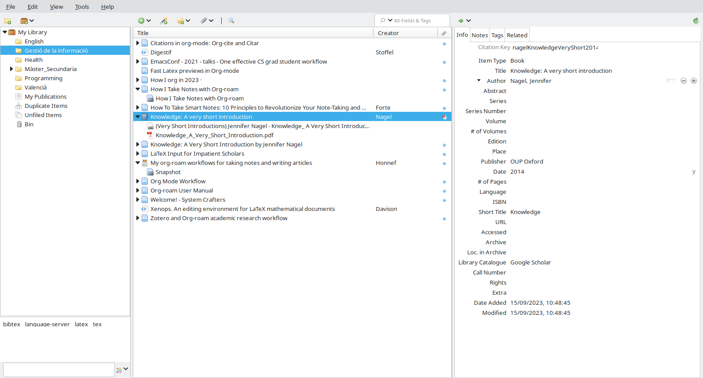
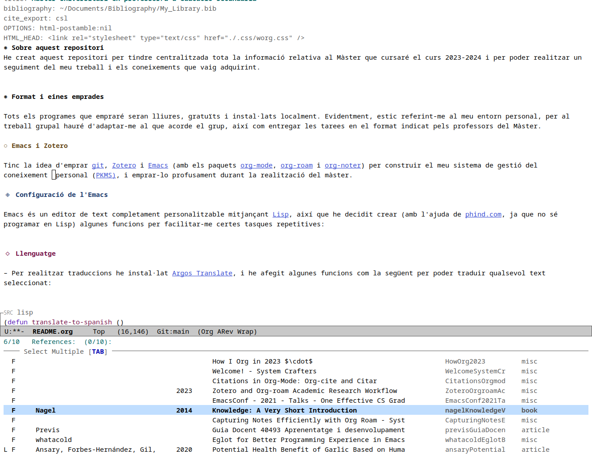
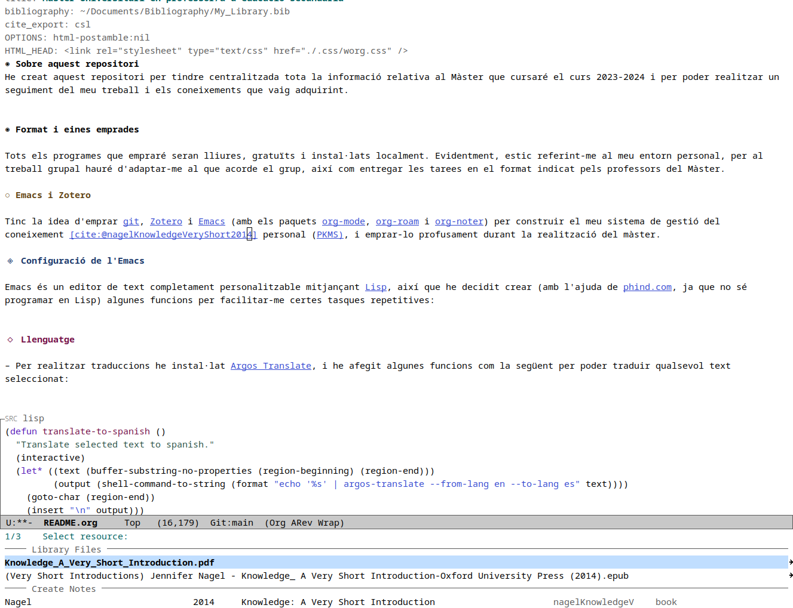
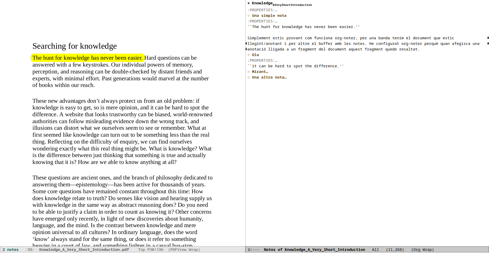

# Table of Contents

-   [Gestor bibliogràfic: Zotero](#org225e3aa)
-   [Emacs](#org038da9c)
    -   [Funcions pròpies creades per mi](#orgae67ba7)
    -   [Paquets adicionals](#org038f193)
-   [Organització de la informació](#org2e700e0)
-   [Publicació de una web](#orgec4b233)
-   [Notes finals](#org17f70a7)
-   [Referències](#org87c9b89)

Empraré [git](https://git-scm.com/), [Zotero](https://www.zotero.org) i [Emacs](https://www.gnu.org/software/emacs/) (així com els paquets [org-mode](https://orgmode.org/), [org-roam](https://www.orgroam.com/) i [org-noter](https://github.com/org-noter/org-noter) d'aquest) per construir el meu sistema de gestió del *coneixement* (<a href="#citeproc_bib_item_1">Nagel 2014</a>) personal ([PKMS)](https://www.reddit.com/r/PKMS/), i emprar-lo profusament durant la realització del màster.

La idea és emprar programes lliures, gratuïts i tindre'ls instal·lats localment (bé siga al portatil o a la meua xarxa local, evitant els serveis *en el nuvol*). Evidentment, estic referint-me al meu entorn personal, per al treball grupal hauré d'adaptar-me al que acorde el grup, així com entregar les tarees en el format indicat pels professors del Màster.

Altres alternatives que he mirat són fer ús de markdown i programes com [obsidian](https://obsidian.md/), [logseq](https://logseq.com/), &#x2026; però la versatilitat i absoluta personalització del combo Emacs/org-mode/org-roam/&#x2026; m'ha fet decantar-me per esta última opció.

# Gestor bibliogràfic: Zotero

Com a gestor bibliogràfic empre [Zotero](https://www.zotero.org),

conjuntament amb:

-   L'[extensió per al navegador web](https://www.zotero.org/download/) ([Firefox](https://www.mozilla.org/en-US/firefox/) en el meu cas). Facilita molt baixar els documents des d'Internet, o si el que estem llegint és una pàgina web, realitzar una captura local d'aquesta.

-   El plugin [Better Bibtex,](https://retorque.re/zotero-better-bibtex/) que exporta la bibliografia de Zotero a format bibtex, per emprar-la en la creació de documents en els formats org-mode o $\LaTeX$, per exemple.

Ara bé, la lectura de la documentació, així com les notes de la mateixa, intentaré realitzar-les des del propi Emacs, emprant org-noter i pdf-tools.

# Emacs

La raó per emprar Emacs és que vull emprar el mode org, i org-roam, per construir el meu sistema de gestió del coneixement.

Per a les cites i referències dins d'Emacs empraré el paquet [citar](https://github.com/emacs-citar/citar). En la següent captura estic inserint una referència:

Una vegada inserida la referència, puc obrir el document associat a la mateixa (que sempre intente tindre com adjunt en Zotero): 

Per llegir i anotar els documents també empraré Emacs, fent ús d'[org-noter](https://github.com/weirdNox/org-noter) i [pdf-tools](https://github.com/vedang/pdf-tools):

Totes les notes associades a una referència bibliogràfica estaran dins d'un mateix fitxer *.org* que també constituirà un node d'*org-roam*, de manera que en qualsevol moment puc buscar un node d'org-roam i si este fa referència a qualsevol document puc obrir el *pdf* i continuar prenent anotacions. Evidentment, les idees que considere més important les guardaré en el meu *repositori* de notes d'org-roam.

Per altra banda, els documents, presentacions, capítols, &#x2026; proporcionats pels professors els revisaré fent ús d'org-noter, però no guardaré un node org-roam per a ells (sí, com sempre, per a qualsevol idea extreta d'ells que vulga guardar-hi).

## Funcions pròpies creades per mi

Emacs és un *editor de text* completament personalitzable mitjançant [Lisp](https://en.wikipedia.org/wiki/Emacs_Lisp), així que he decidit crear (amb l'ajuda de [phind.com](https://www.phind.com), ja que apenes conec Lisp) algunes funcions per facilitar-me certes tasques repetitives. Així, m'he creat funcions per realitzar traduccions amb [Argos Translate](https://github.com/argosopentech/argos-translate), per llegir en veu alta el text sel·leccionat (en aquest cas emprant [piper](https://github.com/rhasspy/piper)) i  per transcriure fonèticament el text seleccionat (mitjançant [espeak-ng](https://github.com/espeak-ng/espeak-ng)) -sí, per ara, són totes per facilitar-me la comprensió de documents escrits en anglés-.

A continuació mostre un exemple de les funcions creades:

    (defun speak-selected-text ()
      "Speak the text selected."
      (interactive)
      (let* ((text (buffer-substring-no-properties (region-beginning) (region-end)))
    	 (escaped-text (replace-regexp-in-string "'" "'\\\\''" text))
    	 (final-text (replace-regexp-in-string "\\*" "" escaped-text)))
        (shell-command (format "echo '%s' | piper --data-dir
        ~/.local/share/piper-voices/
      --model ~/.local/share/piper-voices/en_GB-alba-medium.onnx
    --output-raw  | aplay -r 22050 -f S16_LE -t raw" final-text))))

Totes les altres funcions són petites variacions d'aquesta, ja que són funcions que passen el text seleccionat a un programa extern.

## Paquets adicionals

Alguns dels paquets que he instal·lat en Emacs són corfu, vertico, embark, orderless, marginalia, languagetool, &#x2026;

És possible que més endavant puje a este repositori l'arxiu *.emacs* amb la meua configuració.

# Organització de la informació

<del>Donat que empraré org-roam no necessite guardar i classificar la informació seguint la típica estructura de directoris i subdirectoris. El que tinc pensat és crear un node per a cadascuna de les assignatures del Màster, de manera que per a cada assignatura creare un sol fitxer *.org* que estarà al directori org-roam. Aquest fitxers estaràn també enllaçats al meu repositori *git* local del Màster.</del>
Encara que tenia pensat emprar profusament org-roam, el que m'evita pensar en una estructura de directoris/subdirectoris, finalment sols emprare org-roam per guardar les idees més importants i tindre-les accesibles en qualsevol punt, però els apunts, treballs, tarees, etc. de cada assignatura els guardaré directament en directoris separats del repossitori git principal.

# Publicació de una web

Publicar tot el que escriga en format org-mode a html és realment directe, de manera que segurament publique una web amb el contingut elaborat per mi, i que em facilite, per exemple, accedir als apunts i treballs directament des del movil. La idea és mantindre la web emprant [github pages](https://pages.github.com/), tal com faig fer amb el [Treball de fi de Grau](https://casimirvictoria.github.io/TFG-Semiconductores_2D/), si bé en aquella ocasió no vaig acabar la web, ja que la vaig començar massa tard. Ara he començat a treballar directament emprant git i org-mode (no markdown + [Jupyter Book](https://jupyterbook.org/) com en aquella ocasió)

Hi ha moltes opcions que podem configurar quan volem exportar a html, però en principi sols modificaré l'estil *css* de la web creada, i per ara estic per decidir-me entre el de [worg](https://orgmode.org/worg/) i el de [tufte](https://edwardtufte.github.io/tufte-css/) (m'agrada molt l'estil senzill i elegant de worg.css, així com que la taula de continguts estiga plegada i siga flotant).

# Notes finals

Per finalitzar volia fer notar que encara estic començant a vore com treballar comodament amb org-mode i org-roam, però amb les poques proves que he realitzat sembla que sí que l'adoptare per gestionar tota la meua informació, no sols la relativa al màster. El fet de treballar amb text pla i buscar i relacionar la informació mitjançant una base de dades, tot baix una interfaç molt senzilla, m'agrada molt. A més, el fet de poder personalitzar completament l'entorn al meu gust i necessitats és una passada.

# Referències

  
Nagel, Jennifer. 2014. <i>Knowledge: A Very Short Introduction</i>. OUP Oxford.

